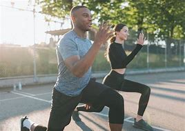

# The 1% Rule

## What I would like to achieve

I would like to build a website focused on holistic well-being, where intellectual, spiritual, emotional, and physical energies are integrated under one umbrella, using the concept of the 1% Rule.

## Why

**Wellbing** has recently become a widely discussed topic. 
However, it is rarely approached from a holistic perspective. 
The focus is often on a healthy diet or exercise, sometimes on meditation, and less frequently on mindset. 
The objective of this platform is to **raise awareness** *that the four mentioned energies*—**intellectual**, **spiritual**, **emotional**, and **physical**—*should be integrated and nurtured simultaneously* for a person **to live a fulfilling life and achieve their full potential.**

## Target audiance
*Since wellbeing is crucial for every human being, the target audiance is 
every person on the planet.*

## Criteria of Success

1. Delivering a simple (3 page) website to domonstrate the skills gained 
in HTML and CSS
2. Delivering the project on time (on or before the 27th of October 2024)
3. Achieve competency in using assoicated tools such as GitHub and Visual Studio
4. A future criterion for success, beyond the bootcamp's time frame, 
is to market the website and enable billions of people around the world to benefit 
from it, helping them achieve **their full potential**

## Stakeholders

- Mr. Komal Karir: Full Stack Software Development Bootcamp Tutor
- Dr. Ashraf Bocktor: Resposible for delivering the project
- Other participants of the Full Stack Software Development Bootcamp
- Candice Fanning: Bootcamp's first point of contact for non-technical issues
- Code Institute support team

## Requirements

1. The website will consist of a home page, about page and a contact page
2. Prepare a README.md file to describe the project.
3. The website must be responsive for mobile, tablet, and desktop views
4. The website should accommodate special needs
5. The website should be deployed on GitHub
6. It is nice to have a logo and a footer on each page

## Testing
1. The website should be tested for browser compatibility
 (Chrome, Edge, Safari, and Firefox)
2. The website should be tested 
for responsiveness on various devices (mobile, tablet, and desktop)
3. The website should be tested to ensure it
 meets the criteria for accommodating special needs

## Website Structure

- Home Page
- About Page
- Contact Page

## Resources

### Images

### Wireframe

Here is the wireframe PDF file of the initial design of the website.  
[View the Wireframe](./assets/documents/WireframeProject.pdf)

<!-- <a href="./assets/documents/WireframeProject.pdf" target="_blank">View the Wireframe</a> -->

### Tools

- Visual Studio Code editor
- Github: https://github.com/
- figma for designing the webpage and produce a wireframe:https://www.figma.com/
- pexels for getting free photos: https://www.pexels.com/

## Future Work
1. I would like each picture to link to a new page that provides more comprehensive information
 and resources about the well-being dimensions 
 (intellectual, spiritual, emotional, and physical)
2. I would like to add another page to the About and Contact pages, 
which will be a Daily Inventory page. On this page, 
I would like users to have the opportunity to record/journal 
their activities covering the four dimensions